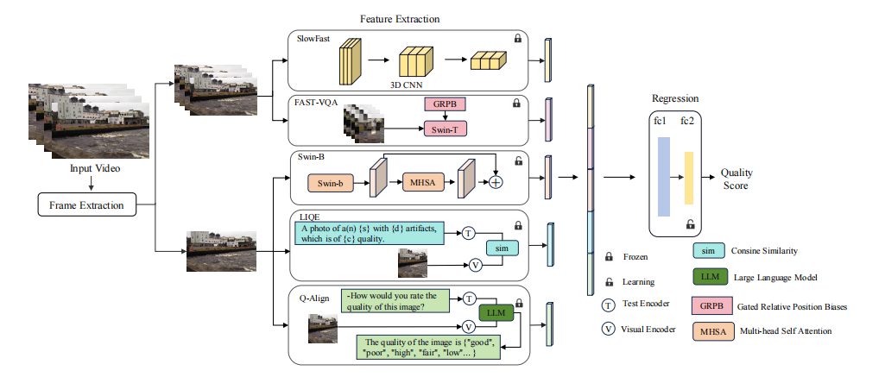
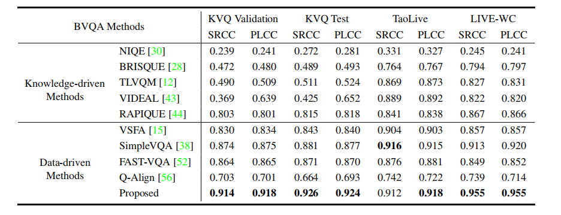

# RQ-VQA

 [](https://github.com/sunwei925/RQ-VQA)
[](https://pytorch.org/)
[](https://github.com/sunwei925/RQ-VQA)
[](https://arxiv.org/abs/2405.08745)


🏆 🥇 **Winner solution for [NTIRE 2024 Short-form UGC Video Quality Assessment Challenge](https://codalab.lisn.upsaclay.fr/competitions/17638) at the [NTIRE 2024](https://cvlai.net/ntire/2024/) workshop @ CVPR 2024** 


Official Code for **[Enhancing Blind Video Quality Assessment with Rich Quality-aware Features](https://arxiv.org/abs/2405.08745)**

### TODO 
- [ ] release the test code for a single video
- [ ] release the training code for other VQA datasets

### Introduction
In this paper, we present a simple but effective method to enhance blind video quality assessment (BVQA) models for social media videos. Motivated by previous researches that leverage pre-trained features extracted from various computer vision models as the feature representation for BVQA, we further explore rich quality-aware features from pre-trained blind image quality assessment (BIQA) and BVQA models as auxiliary features to help the BVQA model to handle complex distortions and diverse content of social media videos. Specifically, we use SimpleVQA, a BVQA model that consists of a trainable Swin Transformer-B and a fixed SlowFast, as our base model. The Swin Transformer-B and SlowFast components are responsible for extracting spatial and motion features, respectively. Then, we extract three kinds of features from Q-Align, LIQE, and FAST-VQA to capture frame-level quality-aware features, frame-level quality-aware along with scene-specific features, and spatiotemporal quality-aware features, respectively. Through concatenating these features, we employ a multi-layer perceptron (MLP) network to regress them into quality scores. Experimental results demonstrate that the proposed model achieves the best performance on three public social media VQA datasets.


### Model


### Performance
#### Performance on social media video quality assessment datasets



#### Performance on NTIRE Challenge


| Team | SRCC | PLCC | RANK1 | RANK2 | Scores |
| :---: | :---:| :---:|:---: |:---: |:---: |
| **SJTU MMLab (ours)** | **0.9361** | **0.9359** | **0.7792** | 0.8284 | **0.9228** |
| IH-VQA (WeChat) | 0.9298 | 0.9325 |  0.7013 |  0.8284 | 0.9145 |
| TVQE (Tecent) | 0.9268 | 0.9312 |  0.6883 | 0.8284 | 0.9120 |
| BDVQAGroup (ByteDance) | 0.9275 | 0.9211 |  0.7489 | **0.8462** | 0.9116 |
| VideoFusion (Zhejiang University) | 0.9026 | 0.9071 |  0.7186 | 0.8580 | 0.8932 |


- for more results on the NTIRE challenge, please refer to the [challenge report](https://openaccess.thecvf.com/content/CVPR2024W/NTIRE/papers/Li_NTIRE_2024_Challenge_on_Short-form_UGC_Video_Quality_Assessment_Methods_CVPRW_2024_paper.pdf).

### Usage

#### Environments
- Base model: timm==0.6.13 (higer version will cause error), pytorch>=1.13 (test on 1.13), torchvision, cv2, pandas
- For FAST-VQA feature extraction: the same requirement in https://github.com/VQAssessment/FAST-VQA-and-FasterVQA
- For LIQE feature extraction: ftfy, regex, tqdm, clip (pip install git+https://github.com/openai/CLIP.git)
- For Q-Align feature extraction: the same requirement in https://github.com/Q-Future/Q-Align

#### Dataset
Download the [KVQ dataset](https://lixinustc.github.io/projects/KVQ/)

#### Train RQ-VQA
- Frame extraction
```
python frame_extraction/extract_frame_NTIREVideo_384p.py --filename_path data/train_data.csv --videos_dir /data/sunwei_data/ntire_video --save_folder /data/sunwei_data/ntire_video/test_image_384p
python frame_extraction/extract_frame_NTIREVideo_original.py --filename_path data/train_data.csv --videos_dir /data/sunwei_data/ntire_video --save_folder /data/sunwei_data/ntire_video/test_image_original # for extracting LIQE and Q-Align features
```

- SlowFast feature extraction
```
CUDA_VISIBLE_DEVICES=0 python -u feature_extraction/extract_SlowFast_feature_VQA.py \
--database NTIREVideoTest \
--resize 224 \
--feature_save_folder  /data/sunwei_data/ntire_video/NTIREVideo_Train_SlowFast_feature/ \
--datainfo_test data/train_data.csv \
--videos_dir /data/sunwei_data/ntire_video
```

- LIQE features extraction

Download the [model weights](https://drive.google.com/file/d/1GoKwUKNR-rvX11QbKRN8MuBZw2hXKHGh/view?usp=sharing)
```
CUDA_VISIBLE_DEVICES=0 python -u feature_extraction/extract_LIQE_feature_KVQ.py --videos_dir_test /data/sunwei_data/ntire_video/test_image_original --feature_save_folder /data/sunwei_data/ntire_video/LIQE_feature/ --datainfo_test data/train_data.csv
```


- FASTVQA features extraction

You should put the path of data csvfile in Line 18 (data/train_data.csv), data path in Line 19, and pretrained [FAST_VQA_B_1*4.pth](https://1drv.ms/u/s!AsQt2I-RXJHQjoN0b_-BsMm-VHSGNw?e=PMKNTh) path in Line 50 in options/fast-b_NTIRE_UGC.yml
```
cd features/FastVQA_feature
CUDA_VISIBLE_DEVICES=0 python extract_fastvqa_feature.py \
--opt options/fast-b_NTIRE_UGC.yml \
--save_path /data/sunwei_data/ntire_video/FASTVQA/sampled/
```
- Q-Align features extraction
```
cd feature_extraction/Q-Align
read the readme.txt for feature extraction 
```


To facilitate the reproduction of the experiments, we provide SlowFast, FASTVQA, LIQE and Q-Align features for the [KVQ training, validation, and test sets](https://www.dropbox.com/scl/fi/sp80tb9se3jxj8f0cptlx/features.tar?rlkey=ea7n5m4us1064c6wi7gbwgyvd&st=1198mttn&dl=0).

- Train the model

Download the [pre-trained model](https://drive.google.com/file/d/1jgzVV0sil0kGhhHIV0RLr6YoDZNp7LNi/view?usp=sharing) on LSVQ
```
  CUDA_VISIBLE_DEVICES=0,1 python -u train.py \
 --database NTIREVideo \
 --model_name RQ_VQA \
 --pretrained_path /home/sunwei/code/VQA/SimpleVQA/ckpts/Swin_b_384_in22k_SlowFast_Fast_LSVQ.pth \
 --multi_gpu \
 --motion \
 --conv_base_lr 0.00001 \
 --epochs 30 \
 --train_batch_size 6 \
 --print_samples 400 \
 --num_workers 6 \
 --ckpt_path ckpts \
 --decay_ratio 0.9 \
 --decay_interval 10 \
 --loss_type plcc \
 --random_seed 10 \
 --n_exp 10 \
 --resize 384 \
 --crop_size 384 \
 >> logs/train.log
```

For computational efficiency, you can simply train the base model, which does not require extracting FASTVQA, LIQE, and Q-Align features.
```
  CUDA_VISIBLE_DEVICES=0,1 python -u train_base_model.py \
 --database NTIREVideo \
 --model_name RQ_VQA_base_model \
 --pretrained_path /home/sunwei/code/VQA/SimpleVQA/ckpts/Swin_b_384_in22k_SlowFast_Fast_LSVQ.pth \
 --multi_gpu \
 --motion \
 --conv_base_lr 0.00001 \
 --epochs 30 \
 --train_batch_size 6 \
 --print_samples 400 \
 --num_workers 6 \
 --ckpt_path ckpts \
 --decay_ratio 0.9 \
 --decay_interval 10 \
 --loss_type plcc \
 --random_seed 10 \
 --n_exp 10 \
 --resize 384 \
 --crop_size 384 \
 >> logs/train.log
```

#### Test RQ-VQA
- Download the [model weighs](https://drive.google.com/file/d/1mcJdgYZPybUvLfWTUtZOhktsSsPlekgv/view?usp=sharing) trained on KVQ.
- Extract video frames, SlowFast features, FASTVQA features, LIQE features, and Q-Align features of KVQ validation and test sets.
- Run the code
```
CUDA_VISIBLE_DEVICES=0 python -u test.py \
--save_file results.csv \
--n_exp 10 \
--resize 384 \
--crop_size 384 \
--pretrained_path  \ # put the folder of trained model here
>> test.log
```


### Citation
**If you find this code is useful for  your research, please cite**:

```latex
@article{sun2024enhancing,
  title={Enhancing Blind Video Quality Assessment with Rich Quality-aware Features},
  author={Sun, Wei and Wu, Haoning and Zhang, Zicheng and Jia, Jun and Zhang, Zhichao and Cao, Linhan and Chen, Qiubo and Min, Xiongkuo and Lin, Weisi and Zhai, Guangtao},
  journal={arXiv preprint arXiv:2405.08745},
  year={2024}
}
```

### Acknowledgement

1. <https://github.com/zwx8981/LIQE>
2. <https://github.com/VQAssessment/FAST-VQA-and-FasterVQA>
3. <https://github.com/Q-Future/Q-Align>